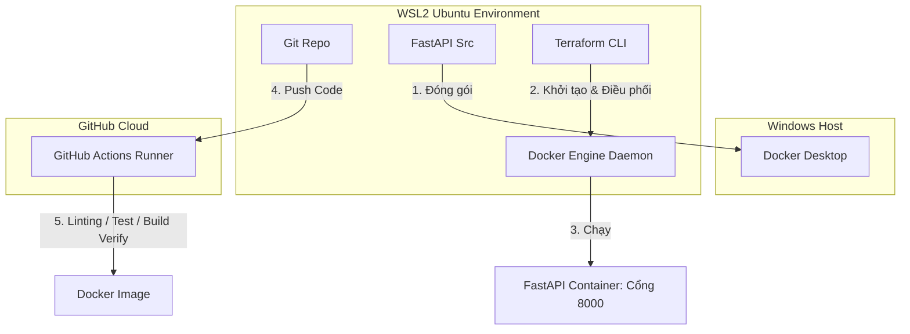

# Local DevOps Pipeline Project (FastAPI + Docker + Terraform + GitHub Actions)

Dự án này là một mô hình thực hành **DevOps Pipeline** thu nhỏ chạy hoàn toàn trên máy cá nhân (**Local**). Mục tiêu cốt lõi của dự án là chứng minh tư duy vận hành hệ thống, tự động hóa và quản lý hạ tầng bằng code (IaC).

---

## 🏗️ Kiến Trúc Hệ Thống (Architecture)

Dưới đây là sơ đồ luồng hoạt động của dự án trên máy cá nhân tích hợp giữa Windows và WSL2:



---

## 🛠️ Công Nghệ Sử Dụng & Vai Trò Trong Dự Án

| Công nghệ | Vai trò trong dự án | Ý nghĩa thực tiễn đối với AWS |
| :--- | :--- | :--- |
| **FastAPI** (Python) | Xây dựng API giả lập thiết bị IoT gửi dữ liệu telemetry. | Thiết kế Microservices, Web Services. |
| **Docker** | Đóng gói ứng dụng thành Container độc lập, tối ưu hóa qua Multi-stage build. | Tiền đề để làm việc với Amazon ECS, EKS và AWS Fargate. |
| **Terraform** | Quản lý hạ tầng container và mạng (Network) bằng code (IaC) thông qua Docker Provider. | Kỹ năng viết mẫu thiết kế hạ tầng, nền tảng cho AWS CloudFormation và AWS CDK. |
| **GitHub Actions** | Tự động hóa kiểm thử mã nguồn (Pytest, Linting) và thử nghiệm build Docker image. | Quy trình CI/CD hoàn chỉnh, nền tảng cho AWS CodePipeline, CodeBuild, CodeDeploy. |

---

## 🚀 Hướng Dẫn Cài Đặt Môi Trường (Setup Local)

### Bước 1: Kích hoạt WSL2 & Cài đặt Ubuntu
1. Mở **PowerShell** trên Windows với quyền Administrator.
2. Chạy lệnh sau để cài đặt WSL2 và Ubuntu:
   ```bash
   wsl --install
   ```
3. Khởi động lại máy tính nếu được yêu cầu và thiết lập Username/Password cho Ubuntu.

### Bước 2: Cài đặt Docker Desktop
1. Tải và cài đặt [Docker Desktop cho Windows](https://www.docker.com/products/docker-desktop/).
2. Trong lúc cài đặt, đảm bảo tích chọn **"Use the WSL 2 based engine"**.
3. Sau khi cài đặt xong, mở Docker Desktop:
   * Vào **Settings (Bánh răng)** -> **Resources** -> **WSL Integration**.
   * Bật tùy chọn **"Enable integration with my default WSL distro"** (ví dụ Ubuntu).
   * Nhấn **Apply & Restart**.

### Bước 3: Cài đặt Terraform trong WSL2
Mở terminal Ubuntu trên WSL2 và chạy lần lượt các lệnh sau:
```bash
# 1. Cài đặt các thư viện hỗ trợ
sudo apt-get update && sudo apt-get install -y gnupg software-properties-common wget

# 2. Thêm khóa GPG của HashiCorp
wget -O- https://apt.releases.hashicorp.com/gpg | gpg --dearmor | sudo tee /usr/share/keyrings/hashicorp-archive-keyring.gpg > /dev/null

# 3. Thêm repository của HashiCorp vào nguồn apt
echo "deb [signed-by=/usr/share/keyrings/hashicorp-archive-keyring.gpg] https://apt.releases.hashicorp.com/gpg $(lsb_release -cs) main" | sudo tee /etc/apt/sources.list.d/hashicorp.list

# 4. Cài đặt Terraform
sudo apt-get update && sudo apt-get install terraform
```

---

## 💻 Hướng Dẫn Chạy Dự Án (How to Run)

### 1. Khởi chạy bằng Terraform
Di chuyển vào thư mục `terraform` trong WSL2 và thực hiện:

```bash
# Khởi tạo Terraform Docker provider
terraform init

# Kiểm tra tính đúng đắn của file cấu hình
terraform validate

# Kích hoạt toàn bộ hạ tầng (Tự động build Docker Image và chạy Container)
terraform apply -auto-approve
```

Sau khi chạy thành công, terminal sẽ hiển thị các URL đầu ra.

### 2. Kiểm thử API trên Trình Duyệt
Mở trình duyệt trên Windows của bạn và truy cập:
* **Trang chủ:** [http://localhost:8000/](http://localhost:8000/) (Kiểm tra trạng thái hệ thống).
* **API Telemetry:** [http://localhost:8000/telemetry](http://localhost:8000/telemetry) (Xem dữ liệu cảm biến IoT giả lập).

### 3. Tắt và Dọn Dẹp Hạ Tầng
Khi muốn dừng ứng dụng và xóa toàn bộ tài nguyên (Container, Network) đã tạo:
```bash
terraform destroy -auto-approve
```

---

## 🔄 Luồng Hoạt Động Của GitHub Actions (CI/CD)
Khi bạn push mã nguồn này lên kho lưu trữ GitHub của mình:
1. GitHub Actions sẽ tự động kích hoạt Runner.
2. Kiểm tra chất lượng mã nguồn bằng **Flake8** (Linter) và **Black** (Formatter).
3. Chạy các bài Unit Test với **Pytest** để đảm bảo code hoạt động chính xác.
4. Kiểm thử quá trình đóng gói Docker bằng **Docker Buildx** để kiểm chứng độ tin cậy của file `Dockerfile`.
